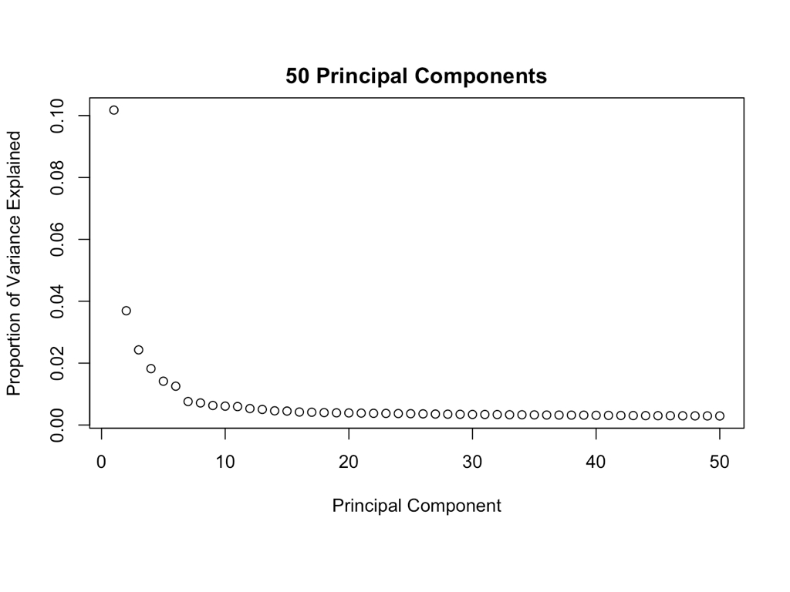
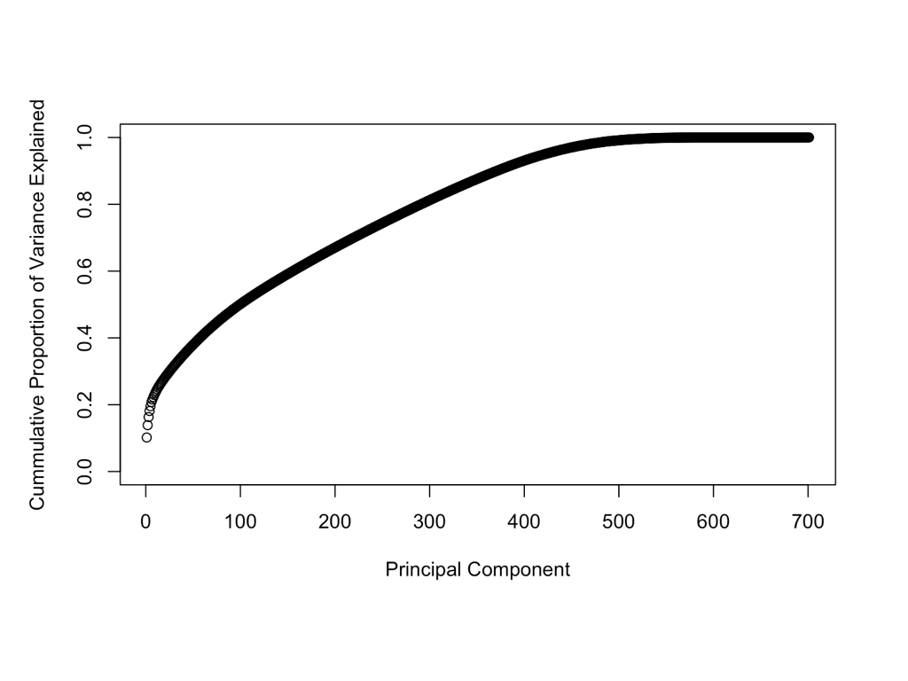

```{r setup, include=FALSE}
knitr::opts_chunk$set(echo = TRUE)
```

# Introduction

The purpose of the project was to build a classifier that would predict which lead would convert to a customer. With this classifier, sales agents can target leads with higher liklihoods of converting before diving into their usual selling process. This ultimately would increase the number of sales (more effective touchpoints for conversion) and decrease the cost of a sale (more effective use of agents' time).

For simplicity, I'll assume that their method is random, which can be quantified by an AUC of 0.5. The reasoning behind using the AUC is discussed in the next section.

# Data

The data given was a single file, `data/raw.csv`, containing 20658 observations and 292 variables. I've preprocessed the data according to the `cleanse()` function in `code/my_fxns.R`. The function does the following:

1. Removes non-informative and mostly missing variables. It removes variables whose values are more than 95% missing, and variables that only had one value throughout the column.
2. Removes misplaced observations. Some variables are misplaced. e.g., Albuquerque is in the `state` column for an observation.
3. Treats `NA`s in character and integer variables as separate category.
4. Removes name & DOB columns.
5. Converts data types using manually-made `data/dict.csv`, which contains names of ordinal factor variables and other variables that'd be better encoded as integers or numerics.

The result of this initial preprocessing is stored in an object called `clean_data` resulting from the code chunk below.

It's important to note that the nature of this conversion data is heavily imbalanced. That is, only about 3% of the leads converted, so even if the model predicts there are no conversions, it'd be 97% accurate. Accounting for both false and true positive rates, the AUC of the ROC is a better evaluation metric of the model than the accuracy of the model.


```{r, echo = FALSE, comment = FALSE, message = FALSE, include = FALSE}
source("../code/my_fxns.R")
```


```{r, eval = FALSE}
# Source my functions
source("code/my_fxns.R")

# Import raw dataset
raw <- read_csv("data/raw.csv")

# Clean data
clean_data <- cleanse(raw) # from my_fxns.R

# Splitting data into training and testing sets
set.seed(11)
index <- sample(nrow(clean_data), size = nrow(clean_data) * 0.75)
train <- clean_data[index, ]
test <- clean_data[-index, ]
```

The cleaned data has 20,603 rows and 247 columns.

# Methods

## Only using numeric data at first

At first, I used just the numeric data to train a logistic regression model. To select the predictor variables, I ranked the importance of each numerical variable (i.e., both `"numeric"` and `"integer"` data types of `clean_data`) based on the correlation coefficient of each numerical variable and the predictor variable (i.e., the `label` column). I've fit a model using the top five most correlated variables and created `crude_mdl` as shown below. This was my benchmark model.

```{r, eval = FALSE}
# ----------------------------------------------------------------------------------------
# Rank importance based on correlation coefficients
# ----------------------------------------------------------------------------------------
cors <- c()
k <- 1
train_numeric <- cbind(extractNum(train), label = as.integer(train$label) - 1)
test_numeric <- cbind(extractNum(test), label = as.integer(test$label) - 1)

for(col_name in names(train_numeric)) {
  cors[k] <- abs(cor(train_numeric[[col_name]],
                     train_numeric$label))
  k <- k + 1
}

cor_importance <- cbind(names(train_numeric), cors)
cor_df_num <- as.data.frame(cor_importance)
cor_df_num <- cor_df_num %>% arrange(desc(cors))
cor_df_num$V1 <- as.character(cor_df_num$V1)

# ----------------------------------------------------------------------------------------
# Make model based on top 5 values from `cor_df_num`
# ----------------------------------------------------------------------------------------
crude_mdl <- glm(formula = label ~ ibe2834_2834 + ibe9350_9350 + 
                   GC1027_Prop_Bills_Automatically_Charged_Credit_Card_Fin_gc1027_rank +
                   Gc1024_Bill_Paying_Mthds_Used_Last_12_Months_Pay_In_Person_gc1024_rank +
                   GC611_Prop_Obtain_Dental_Ins_gc611_rank,
                 data = train_numeric,
                 family = binomial(link = "logit"))

# ----------------------------------------------------------------------------------------
# Evaluate model
# ----------------------------------------------------------------------------------------
get_auc(crude_mdl) # 0.6736
```

```{r, echo = FALSE}
crude_mdl <- readRDS("../models/crude_mdl.rds")
get_auc(crude_mdl)
```

The AUC of this crude model was 0.6736 which is already significantly better than random guessing!

Next, I tried selecting predictor variables using the forward selection algorithm, which picks important variables based on AIC. Again, just using the numerical data, I've fit a null and full model and ran the algorithm.

```{r, eval = FALSE}
# ----------------------------------------------------------------------------------------
# Logistic regression model, forward selection
# ----------------------------------------------------------------------------------------
null_mdl <- glm(label ~ 1, family = binomial(link = "logit"), data = train_numeric)
full_mdl <- glm(label ~ ., family = binomial(link = "logit"), data = train_numeric)

step_mdl <- step(null_mdl,
                 scope = list(lower = null_mdl, upper = full_mdl),
                 direction = "forward")

forward_mdl <- glm(formula = formula(step_mdl),
                   family = binomial(link = "logit"), data = train_numeric)

# ----------------------------------------------------------------------------------------
# Evaluate model
# ----------------------------------------------------------------------------------------
get_auc(forward_mdl) # 0.696
```

```{r, echo = FALSE}
forward_mdl <- readRDS("../models/forward_mdl_num.rds")
get_auc(forward_mdl)
```

The AUC of the model increased slightly to 0.696.

Next, to account for the imbalance of the data, I tried both upsampling and downsampling the observations in the `train_numeric` dataset such that the data associated with a conversion was given more weight when training the model. By upsampling the observations associated with a conversion or downsampling the observations associated with a not-conversion, I provided the model a better sense of the conversion instance relative to the sense of the not-conversion instance.

The `caret` package's `upSample()` and `downSample()` functions balance the data such that binary response variable has an even split.

```{r, eval = FALSE}
# ----------------------------------------------------------------------------------------
# Upsample train set
# NOTE: upSample() defaults to 50/50 distribution of binary response variable
# ----------------------------------------------------------------------------------------
upsample_train <-  upSample(train_numeric[, -c(ncol(train_numeric))],
                            as.factor(train_numeric$label),
                            yname = "label")

upsample_null_mdl <- glm(label ~ 1, family = binomial(link = "logit"),
                         data = upsample_train)
upsample_full_mdl <- glm(label ~ ., family = binomial(link = "logit"),
                         data = upsample_train)

upsampled_step_mdl <- step(upsample_null_mdl,
                           scope = list(lower = upsample_null_mdl,
                                        upper = upsample_full_mdl),
                           direction = "forward")

upsampled_forward_mdl <- glm(formula = formula(upsampled_step_mdl),
                             family = binomial(link = "logit"),
                             data = upsample_train_numeric)

# ----------------------------------------------------------------------------------------
# Downsample train set
# ----------------------------------------------------------------------------------------
downsample_train <- downSample(train_numeric[, -c(ncol(train_numeric))],
                               as.factor(train_numeric$label),
                               yname = "label")

downsample_null_mdl <- glm(label ~ 1, family = binomial(link = "logit"),
                           data = downsample_train)
downsample_full_mdl <- glm(label ~., family = binomial(link = "logit"),
                           data = downsample_train)

downsampled_step_mdl <- step(downsample_null_mdl,
                             scope = list(lower = downsample_null_mdl,
                                          upper = downsample_full_mdl),
                             direction = "forward")

downsampled_forward_mdl <- glm(formula = formula(downsampled_step_mdl), 
                               family = binomial(link = "logit"),
                               data = downsample_train)

# ----------------------------------------------------------------------------------------
# Evaluate models
# ----------------------------------------------------------------------------------------
get_auc(upsampled_forward_mdl) # 0.6902
get_auc(downsampled_forward_mdl) # 0.6578
```

```{r, echo = FALSE}
up <- readRDS("../models/upsampled_forward_mdl_num.rds")
get_auc(up)

down <- readRDS("../models/downsampled_forward_mdl_num.rds")
get_auc(down)
```

The AUC of the model trained on the upsampled and downsampled data did not perform better at 0.6902 and 0.6578, respectively. This suggests that the information that's not incorporated in the downsampling process is somewhat important in obtaining true and false positives.

## Incorporating categorical variables: Imputation after binarization

So far, I've only used the numeric data. To incorporate the factor variables into the model, I decided to impute its missing values *after* binarizing all factor variables, that is, after creating a binary column for each level of each factor variable. Because `NA`s in factor variables were treated as its own level, the number of observations before and after the imputation are the same, preserving as much information as possible. The `code/imputation_demo.R` file provides an example of how this imputation method is implemented on a simple toy dataset.

After binarization and imputation, some of the resulting columns in the train set did not exist in the test set and vice versa. I decided to keep the columns that existed in both. These sets are named `agg_train2` and `agg_test2`.

```{r, eval = FALSE}
# ----------------------------------------------------------------------------------------
# Separate into numeric and factor data types
# ----------------------------------------------------------------------------------------
train_numeric <- extractNum(train)
train_factor <- extractFac(train)

test_numeric <- extractNum(test)
test_factor <- extractFac(test)

# ----------------------------------------------------------------------------------------
# Binarize factor variables
# ----------------------------------------------------------------------------------------
# NOTE: `label` is excluded within `binarize()`
binarized_train_factor <- binarize(train_factor) 
binarized_test_factor <- binarize(test_factor)

# ----------------------------------------------------------------------------------------
# Combine numeric and binarized factor variables
# ----------------------------------------------------------------------------------------
agg_train <- cbind(train_numeric,
                   binarized_train_factor,
                   label = as.integer(train_factor$label) - 1)
agg_test <- cbind(test_numeric,
                  binarized_test_factor,
                  label = as.integer(test_factor$label) - 1)

# ----------------------------------------------------------------------------------------
# Remove columns in `agg_train` that don't exist in `agg_test`
# ----------------------------------------------------------------------------------------
keep <- intersect(names(agg_train), names(agg_test))
agg_train2 <- agg_train %>% select(keep)
agg_test2 <- agg_test %>% select(keep)
write_csv(agg_test2, "../data/last_test.csv")
# write_csv(agg_train2, "../data/agg_train2.csv")

agg_null_mdl <- glm(label ~ 1, family = binomial(link = "logit"),
                    data = agg_train2)
agg_full_mdl <- glm(label ~., family = binomial(link = "logit"),
                    data = agg_train2)

agg_step_mdl <- step(agg_null_mdl,
                     scope = list(lower = agg_null_mdl,
                                  upper = agg_full_mdl),
                     direction = "forward")

agg_forward_mdl <- glm(formula = formula(agg_step_mdl),
                       family = binomial(link = "logit"), data = agg_train2)

get_last_auc(agg_forward_mdl) # 0.6921
```

```{r, echo = FALSE}
agg_mdl <- readRDS("../models/agg_forward_mdl.rds")
get_last_auc(agg_mdl) # 0.6921
```

Interestingly, many of the most important predictor variables are different across the logistic regression models trained thus far. To account for this, I decided to look at the 20 most important predictor variables common among all models, then fit a final model that only takes variables that exist in this aggregated set of predictor variables.

```{r, eval = FALSE}
# ----------------------------------------------------------------------------------------
# Recall best performing models
# ----------------------------------------------------------------------------------------
root <- "../"
mdl <- readRDS(paste0(root, "models/forward_mdl_num.rds")) # 0.696
mdl2 <- readRDS(paste0(root, "models/upsampled_forward_mdl_num.rds")) # 0.6902
mdl3 <- readRDS(paste0(root, "models/agg_forward_mdl.rds")) # 0.6921

# ----------------------------------------------------------------------------------------
# Get predictor variables
# ----------------------------------------------------------------------------------------
mdl_vars <- get_predictors(mdl)[1:20]
mdl2_vars <- get_predictors(mdl2)[1:20]
mdl3_vars <- get_predictors(mdl3)[1:20]

# ----------------------------------------------------------------------------------------
# Get common predictors among these models
# ----------------------------------------------------------------------------------------
numeric_vars <- intersect(mdl_vars, mdl2_vars)
save <- numeric_vars[numeric_vars %in% mdl3_vars]
factor_vars <- setdiff(mdl3_vars, save)

# ----------------------------------------------------------------------------------------
# Fit model using agg_train2
# ----------------------------------------------------------------------------------------
agg_train2 <- fread(paste0(root, "data/last_train.csv"))
final_mdl <- glm(formula = label ~ ibe2834_2834 + ibe2720_2720 +
                   ibe7607_Home_Length_of_Residence_TO_100PCT_LOR +
                   ibe8463_8463 +
                   ibe7824_7824_1 +
                   state_MA +
                   ibe8604_8604_8 +
                   state_FL +
                   ibe8815_8815_Y +
                   AP004301_Insurance_Consumer_Dynamics_ib1292_03 + ibe9514_9514_3 +
                   ibe7628_Adults_Number_in_Household_Premier_COMPLETE_Precision_Level_4 +
                   ibe2360_2360_C012 + ibe8637_8637_Y + ibe8648_8648_F + ibe8584_8584_E +
                   state_AR,
                 family = binomial(link = "logit"),
                 data = agg_train2)

# ----------------------------------------------------------------------------------------
# Evaluate model
# ----------------------------------------------------------------------------------------
get_last_auc(final_mdl) # 0.7113
```

```{r, echo = FALSE}
final_mdl <- readRDS("../models/final_mdl.rds")
get_last_auc(final_mdl) # 0.7113
```

Incorporating the best predictor variables from both the numeric and factor data into the logistic regression model improved the AUC.

# Results

The best performing model resulted in a AUC of 0.7113.

It's important to note that I did not account for any interactions between the variables nor have I scaled the numeric variables. Also, because the data is from 2013, there could be some time-sensitive nuances (e.g., using Twitter). As a result, the beta coefficients should be interpreted with extra caution, so I'm only concluding based on the positive/negative signs. Looking at the predictor variables and the data dictionary, I conclude the following:

- `ibe2834_2834`: Financially comfortable households are more likely to convert.
- `ibe2720_2720`: More the lead uses Twitter, the less likely they are to convert.
- `ibe7607_Home_Length_of_Residence_TO_100PCT_LOR`: People who moved recently to their homes are more likely to convert.
- `ibe8463_8463`: The more expensive their house is, the more likely to convert.
- `ibe7824_7824_1`: If people are interested any kind of travel, they're less likely to convert.
- `state_MA`: If they're Massachusetts residents, they're more likely to convert.
- `ibe8604_8604_8`: If they're retired, they're more likely to convert.
- `state_FL`: If they're Florida residents, they're less likely to convert. Makes me wonder... if they're retired in Florida, are they more or less likely to convert? This model cannot answer that question.
- `ibe8815_8815_Y`: If they have a bank card in the household, they're more likely to convert.
- `AP004301_Insurance_Consumer_Dynamics_ib1292_03`: If they have their "hands full" in Acxiom’s Insurance Consumer Dynamics scale, then they're more likely to convert.
- `ibe9514_9514_3`: If they completed graduate school, they're more likely to convert.
- `ibe7628_Adults_Number_in_Household_Premier_COMPLETE_Precision_Level_4`: If Acxiom inferred the number of adults in a household for that household, that household is less likely to convert.
- `ibe2360_2360_C012`: If they're a Manager/Marketing Manager, they're less likely to convert.
- `ibe8637_8637_Y`: If they're a Medical Professional, they're less likely to convert.
- `ibe8648_8648_F`: If they have a Mid-size/ Large vehicle, then they're more likely to convert.
- `ibe8584_8584_E`: If their home loan to home value ratio is between 80 and 84% then they're less likely to convert.
- `state_AR`: If they're from Arizona, they're less likely to convert.

# Miscellaneous

I've also tried PCA on the aggregated dataset and tried tree-based methods. However, because the cumulative proportion of variance explained by the principal components indicated that around 350 principal components explained 80% of the variance, I decided not to pursue this further. Any resulting model using the PCA would be very difficult to interpret.

```{r, eval = FALSE}
# Dimensionality reduction w/ PCA
pca_train <- prcomp(agg_train2[, -c(ncol(agg_train2))], scale = TRUE, center = TRUE)

# Variance explained by each principal component
var_explained <- pca_train$sdev^2 / sum(pca_train$sdev^2)

# Plot cumulative proportion of variance explained
plot(cumsum(var_explained), xlab = "Principal Component",
     ylab = "Cummulative Proportion of Variance Explained",
     ylim = c(0, 1), type = "b")

# Plot variance explained by 50 PCs
plot(var_explained[1:50], xlab = "Principal Component",
     ylab = "Proportion of Variance Explained",
     main = "50 Principal Components")
```




```{r, eval = FALSE}
# ----------------------------------------------------------------------------------------
# Fitting decision trees with PCs?
# ----------------------------------------------------------------------------------------
tree_downsample <- rpart(agg_train_down$label ~.,
                         data = agg_train_down[, -c(ncol(agg_train_down))])

tree_upsample <- rpart(agg_train_upsample$label ~.,
                       data = agg_train_upsample[, -c(ncol(agg_train_upsample))])


# Evaluation of two trees: ROC
get_auc(tree_downsample) # 0.6296
get_auc(tree_upsample) # 0.6268

# ----------------------------------------------------------------------------------------
# Fitting random forest
# ----------------------------------------------------------------------------------------
set.seed(77)
rf <- randomForest(y = agg_train_down$label,
                   x = agg_train_down[, -c(ncol(agg_train_down))],
                   ytest = agg_test2$label,
                   xtest = agg_test2[, -c(ncol(agg_test2))],
                   ntree = 1000, mtry = 5, keep.forest = TRUE, na.action = NULL)

(rf_bestmtry <- tuneRF(y = agg_train_down$label,
                       x = agg_train_down[, -c(ncol(agg_train_down))],
                       ytest = agg_test2$label,
                       xtest = agg_test2[, -c(ncol(agg_test2))])) # 13?

rf_tuned <- randomForest(y = agg_train_down$label,
                         x = agg_train_down[, -c(ncol(agg_train_down))],
                         ytest = agg_test2$label,
                         xtest = agg_test2[, -c(ncol(agg_test2))],
                         ntree = 1000, mtry = 13, keep.forest = TRUE, na.action = NULL)

# ----------------------------------------------------------------------------------------
# Evaluate models
# ----------------------------------------------------------------------------------------
get_auc(rf) # 0.6566
get_auc(rf_tuned) # 0.6531
```

